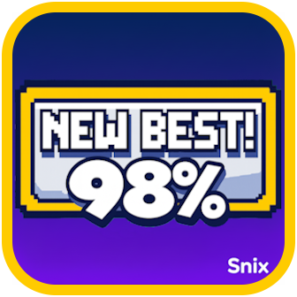

# Edit New Best!



Fine-tune how Geometry Dash celebrates new records. Edit the "NEW BEST!" banner to match your overlay, keep it out of the way, or hide it entirely.

## Features
- Position the banner in preset corners or keep the standard placement.
- Enter exact X/Y coordinates for a completely custom layout.
- Scale the popup from discrete reminders to full-screen spotlights.
- Shorten or extend how long the banner lingers before vanishing.
- Toggle the popup off when you want distraction-free grinding.

## Quick Start
1. Install and enable the mod through the Geode loader.
2. Play a level and hit a new personal best so the banner appears once.
3. Open the Geode overlay, find **Edit New Best!**, and choose **Settings**.
4. Adjust the sliders and toggles, then play again; the next `NEW BEST!` uses your layout.

## Settings Reference
| Setting | Type | What it controls |
| --- | --- | --- |
| Popup Position | Enum | Choose `Default`, `Top Left`, `Top Middle`, `Top Right`, `Bottom Left`, `Bottom Middle`, `Bottom Right`, or `Custom`.
| Custom X / Custom Y | Float | Pixel coordinates when the position is `Custom`.
| Popup Scale | Float | Resize the banner from 0.1× up to 2.0×.
| Popup Duration | Float | Seconds before the popup shrinks away.
| Hide Popup | Bool | Skip displaying the banner entirely.

## Compatibility & Requirements
- Built against Geode SDK `4.8.0`.
- Targets Geometry Dash `2.2074` windows.
- Requires the [Geode loader](https://docs.geode-sdk.org/getting-started/) or the CLI to install.

## Building from Source
```sh
# Assuming the Geode CLI is available
geode build
```
The entry point lives in `src/main.cpp`, where the mod hooks `PlayLayer::showNewBest` to reposition, scale, or hide the popup based on saved settings.

## Repository Notes
- `mod.json` describes the mod metadata, dependencies, and configurable settings.
- `src/main.cpp` contains the PlayLayer hook and runtime behaviour tweaks.
- `about.md` mirrors the in-game description shown to users.

## Helpful Links
- [Geode SDK Documentation](https://docs.geode-sdk.org/)
- [Geode SDK Source](https://github.com/geode-sdk/geode/)
- [Geode CLI](https://github.com/geode-sdk/cli)
- [Bindings](https://github.com/geode-sdk/bindings/)
- [Dev Tools](https://github.com/geode-sdk/DevTools)

